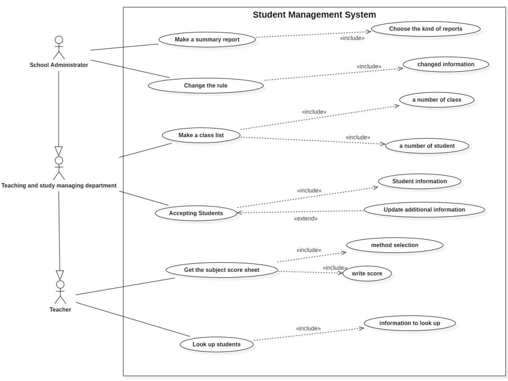
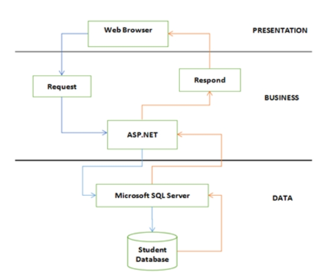

<!-- Banner -->

  

<h1 align="center"><b>NHẬP MÔN CÔNG NGHỆ PHẦN MỀM (Introduction to Software Engineering)</b></h>

# [BẢNG MỤC LỤC](#top)
* [Giới thiệu môn học](#giới-thiệu-môn-học)
* [Thông tin đồ án](#thông-tin-đồ-án)
* [Các bước cần thiết](#các-bước-cần-thiết)
  
# [GIỚI THIỆU MÔN HỌC](#top)
* **Tên môn học:** Nhập môn công nghệ phần mềm - Introduction to Software Engineering
* **Mã môn học:** SE104
* **Mã lớp:** SE104.M22.PMCL
* **Giảng viên:** M.Sc. Mai Trọng Khanh (khangmt@uit.edu.vn)

# [THÔNG TIN ĐỒ ÁN](#top)
* **Đề tài đồ án:** Dự đoán giá thuê nhà tại TP Hồ Chí Minh 
* **Ngôn ngữ lập trình:** C#, SQL
* **Mô tả chung:** Dựa trên khảo sát thực tế, có thể nhận thấy có những công việc tốn rất nhiều thời gian nhưng vẫn được lặp đi lặp lại hàng năm như: tiếp nhận hồ sơ tuyển sinh của học sinh vào trường hàng năm, chia lớp cho học sinh sao cho cân đối, yêu cầu về việc quản lý các môn học cho học sinh trong trường, sắp xếp thời khóa biểu, quản lý và lưu trữ điểm các môn học cho học sinh… … Thông thường những công việc này chỉ dừng lại ở việc sử dụng Excel hoặc một số công cụ khác để thực hiện, quản lý và lưu trữ các dữ liệu cần thiết. Vì vậy, việc xây dựng một phần mềm “Quản lý sinh viên” là một vấn đề vô cùng cần thiết.

# [CÁC BƯỚC CẦN THIẾT](#top)

## 1. Phân tích yêu cầu phần mềm
Phầm mềm quản lý sẽ được xây dựng để thực hiện các tác vụ chính như:
* Quản lý việc tiếp nhận học sinh
* Thực hiện chức năng xây dựng danh sách lớp.
* Xây dựng chức năng quản lý thông tin và kết quả học tập.
* Chức năng nhập và lưu trữ bảng điểm các môn học.
* Chức năng lập báo cáo tổng hợp.

Ngoài ra, phần mềm còn có chức năng khác, cho phép người dùng thay đổi một số dữ liệu mặc định như: độ tuổi được phép vào trường, số lượng học sinh tối đa của một lớp, số lớp hoặc tên từng lớp, số môn học hoặc tên của từng môn và cuối cùng là mức điểm đạt chuẩn.

## 2. Quá trình thực hiện của phần mềm
* ***Tiếp nhận học viên:*** Hồ sơ nhập học của mỗi học sinh sẽ bao gồm các thông tin như tên, giới tính, ngày sinh, địa chỉ và email của học sinh.

* ***Lập danh sách lớp:*** Một lớp học sẽ bao gồm tên, số lượng và thông tin của từng học viên trong lớp đó.

* ***Tra cứu thông tin sinh viên:*** Thông tin cần tra cứu của sinh viên nào sẽ bao gồm họ tên sinh viên, lớp liên kết và điểm trung bình học kỳ I, II của sinh viên đó.

* ***Quản lý bảng điểm khóa học:*** Lưu trữ và cập nhật điểm 15 phút, điểm 1 tiết và điểm trung bình các môn học theo tên của từng học sinh trong từng lớp và từng học kỳ.

* ***Lập báo cáo tóm tắt:*** Việc chuẩn bị báo cáo tổng kết sẽ có 2 phần là báo cáo tổng kết khóa học và báo cáo tổng kết học kỳ. Mỗi phần báo cáo sẽ chứa thông tin về lớp, số lượng của lớp đó cùng với số học sinh đậu và tỷ lệ học sinh đậu lớp đó.

## 3. Bản vẽ sơ đồ ứng dụng

## 4. Xây dựng phần mềm 
### **a. Thiết kế hệ thống**

Trong dự án phần mềm “Quản lý sinh viên” này, nhóm của tôi sẽ sử dụng mô hình 3 lớp để thiết kế hệ thống. Mô hình này bao gồm:

* ***Presentation:*** Dùng để giao tiếp với người dùng. Lớp này bao gồm các thành phần giao diện như winform, webform,… và thực hiện các tác vụ như nhập dữ liệu, hiển thị kết quả truy xuất, kiểm tra tính chính xác của dữ liệu để sẵn sàng cho bước tiếp theo.

* ***Business:*** Lớp đáp ứng được yêu cầu cụ thể của ứng dụng, tại đây có thể hiển thị danh sách học sinh. Lớp này chủ yếu xử lý nguồn dữ liệu từ lớp Presentation trước khi truyền đến lớp Data và sau đó lưu vào DBMS.

* ***Data:*** Có chức năng giao tiếp với DBMS và thực hiện các tác vụ liên quan đến lưu trữ, truy vấn dữ liệu (tìm kiếm, thêm, xóa, cập nhật,…)

Mô tả các thành phần trong hệ thống

| STT | Element               | Giải thích                                 |
| :-: | :-------------------- | :----------------------------------------- |
| 1   | Web Browser           | Chạy với 2 giao thức WML và HTML, chịu trách nhiệm cung cấp giao diện người dùng và thực hiện các thao tác nhập xuất dữ liệu, báo lỗi. |
| 2   | Request               | Yêu cầu giữa các lớp trong hệ thống. |
| 3   | Respond               | Phản hồi các yêu cầu nhận được. |
| 4   | ASP.NET               | Tạo kết nối với SQL và thực hiện các truy vấn cũng như đáp ứng các yêu cầu lớp Business như kiểm tra tính chính xác của ràng buộc, tính toàn vẹn dữ liệu và kiểm tra tính hợp lệ. |
| 5   | Microsoft SQL Server  | Nhận truy vấn và trả kết quả về ASP.NET và thực hiện các tác vụ liên quan đến lưu trữ dữ liệu (thêm, xóa, cập nhật,…) |
| 6   | Student Database      | Lưu trữ dữ liệu cho phần mềm quản lý học sinh. |

### **b. Thiết kế dữ liệu**

Dựa vào các biểu mẫu cũng như các quy tắc ràng buộc để cho ra sơ đồ logic của từng yêu cầu. Danh sách các bảng có trong luồng dữ liệu: 

| STT | Tên bảng                  | Giải thích                                          |
| :--:| :------------------------ | :-------------------------------------------------- |
| 1   | STUDENT                   | Hồ sơ sinh viên                                     |
| 2   | CLASS                     | Thông tin lớp học                                   |
| 3   | GRADE                     | Thông tin khối học                                  |
| 4   | LEARNING PROCESS          | Quá trình học tập của học sinh tại trường           |
| 5   | SEMESTER                  | Thông tin học kỳ                                    |
| 6   | SUBJECT                   | Danh sách các môn học                               |
| 7   | SUBJECT TRANSCRIPT        | Bảng điểm tất cả môn học                            |
| 8   | TYPE OF INSPECTION        | Hình thức kiểm tra và hệ số điểm của từng hình thức |
| 9   | SUBJECT TRANSCRIPT DETAIL | Chi tiết bảng điểm môn học                          |
| 10  | CURRICULUM                | Chương trình giảng dạy của tất cả các lớp           |
| 11  | COURSE SUMMARY            | Báo cáo khóa học                                    |
| 12  | SEMESTER SUMMARY          | Báo cáo tổng kết học kỳ                             |
| 13  | PARAMETER                 | Bảng thông số                                       |

### **c. Thiết kế giao diện người dùng**
Sơ đồ liên kết các màn hình: 

Danh sách chi tiết các màn hình: 

| STT | Màn hình | Loại màn hình     | Chức năng |
| :-: | :------- | :---------------- | :-------- |
| 1   | Student management Screen | Màn hình nhập liệu | Xuất danh sách sinh viên |
| 2   | Age change Screen | Màn hình nhập liệu | Thay đổi độ tuổi tối thiểu, tối đa của học sinh |
| 3   | Student lookup Screen |  Màn hình tra cứu | Cho phép nhập thông tin cần tìm kiếm và hiển thị kết quả tìm kiếm |
| 4   | Students add Screen | Màn hình nhập liệu | Cho phép nhập và lưu trữ thông tin học sinh |
| 5   | Class management Screen | Màn hình nhập liệu | Xuất danh sách lớp học |
| 6   | Quantity change Screen | Màn hình nhập liệu | Thay đổi quy định về số lượng tối đa mỗi lớp  |
| 7   | Add class Screen | Màn hình nhập liệu | Cho phép nhập và lưu trữ thông tin các lớp |
| 8   | Make class list Screen | Màn hình nhập liệu | Cho phép thêm học viên chưa có lớp vào lớp hiện có |
| 9   | Updating class list Screen | Màn hình nhập liệu | Xóa một học sinh khỏi lớp học hiện tại của họ |
| 10  | Curriculum management Screen | Màn hình nhập liệu | Xuất danh sách các môn học có trong các lớp và hệ số tương ứng với môn học |
| 11  | Subject management Screen | Màn hình nhập liệu | Xuất danh sách các môn học và điểm đậu tương ứng |
| 12  | Subjects add Screen | Màn hình nhập liệu | Cho phép nhập các môn và điểm đậu tương ứng, lưu trữ thông tin các môn |
| 13  | Curriculum add Screen | Màn hình nhập liệu | Cho phép thêm môn học và hệ số tương ứng của môn học đó vào điểm học, lưu trữ thông tin giáo trình |
| 14  | Score management Screen | Màn hình nhập liệu | Xuất danh sách điểm các môn học của học sinh trong từng lớp |
| 15  | Subject statistics report Screen | Báo cáo | Trình bày số lượng đậu và tỷ lệ đậu của từng môn tương ứng trong các lớp  |
| 16  | Semester statistics report Screen | Báo cáo | Trình bày số lượng và tỷ lệ học sinh qua môn của các lớp trong học kỳ tương ứng |
| 17  | Semester passing score change Screen | Màn hình nhập liệu | Thay đổi về quy định về mốc điểm đậu|

